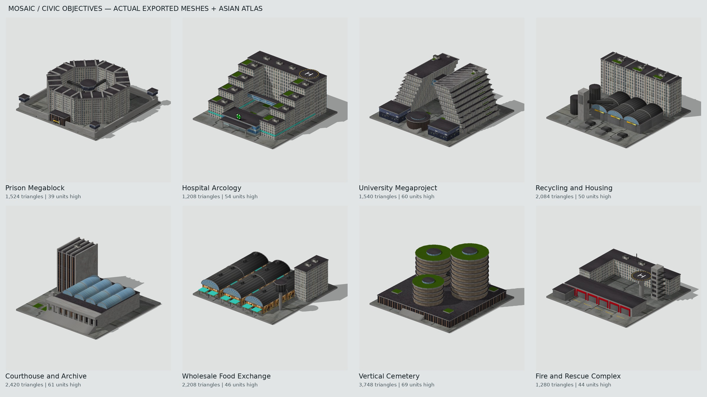

# Civic objective prototypes

Eight actual COLLADA meshes derived from the civic-building concept series,
UV-mapped to the existing Asian atlas. These are deliberately economical first
models for an in-game art/scale test, not image-to-mesh reconstructions of every
detail in the concept renders.



The preview is rendered from the exported DAE files with back-face culling and
shadows. It is an external asset render, not a Recoil screenshot.

| Unit name | Building | Triangles |
|---|---|---:|
| `objective_civic_prison` | Prison Megablock | 1,524 |
| `objective_civic_hospital` | Hospital Arcology | 1,208 |
| `objective_civic_university` | University Megaproject | 1,540 |
| `objective_civic_recycling` | Recycling and Housing | 2,084 |
| `objective_civic_courthouse` | Courthouse and Archive | 2,420 |
| `objective_civic_market` | Wholesale Food Exchange | 2,208 |
| `objective_civic_cemetery` | Vertical Cemetery | 3,748 |
| `objective_civic_fire_rescue` | Fire and Rescue Complex | 1,280 |

## Try them

On a test game with this branch, enable `/cheat`, then run:

```
/luarules civicobjectives
```

This places a 4-by-2 display of Gaia-owned objectives around the map centre.
For another clear patch, specify world coordinates:

```
/luarules civicobjectives 2048 2048
```

The command skips occupied, underwater, steep and out-of-map plots. It does
nothing with cheats disabled. It does not clear existing units. Individual
models can also be placed with the engine's `/give <unit-name> <Gaia-team-id>`
command; use the actual Gaia team ID of the running game.

They are registered as land objectives and enter the existing random objective
pool on procedural maps. Dhubai uses map-controlled placement, so it needs
explicit placements in its map data; this game branch does not edit the map.
The preview command works on that map wherever there is sufficient clear land.

## Gameplay and asset conventions

All eight use the existing objective defend/destroy/reward/restore cycle. Only
Gaia-owned instances become objectives. No separate hospital healing, prison
detention or archive espionage mechanic is introduced by these prototypes.
They use the existing 15,000-HP objective baseline, an 8-by-8 footprint and a
single bounding-box collision volume. Courtyards are visual spaces in this
prototype; the collision volume is not a walkable interior layout.

Each model has four named meshes: `base`, `structure`, `facades`, `details`.
Coordinates are Y-up, ground at Y=0, no scale transform. The geometry fits a
128-by-128 world-unit plot; heights and enclosing radii are generated from the
vertices. The DAE files include a normal COLLADA material and relative diffuse
texture path for import into modelling software that supports COLLADA.

- Diffuse: `unittextures/house_asian_diffuse.dds`
- Illumination/reflection: `unittextures/house_asian_selfilu_reflection.png`
- Normal map: `unittextures/house_asian_normal.dds`

No atlas is edited or duplicated. The Lua model metadata supplies the diffuse
and tex2 mask; UnitDef customparams supplies the normal map. Facades register
with the existing material-mask radiance path and unregister on death. The
static script starts no polling or animation threads and enables no shader
framework. The new build pictures use the exported geometry and shared atlas.

## Source and validation

`tools/civic_objectives/generate.py` is the editable procedural source, using
only the Python standard library. It writes the eight DAE files, their model
metadata, the generated civic-objective configuration and the geometry manifest.
Atlas rectangles are named near the top of the script. Large facades subdivide
their geometry to repeat an atlas island without UV wrap into adjacent artwork.

```
python tools/civic_objectives/generate.py
python -m pip install numpy pillow pycollada moderngl glcontext assimp_py
python tests/civic_models_test.py
lua5.1 tests/civic_objectives_test.lua
python tools/civic_objectives/render.py --atlas unittextures/house_asian_diffuse.dds --output /tmp/civic-previews --update-repo-previews
```

The renderer requires EGL. Game assets themselves need none of these Python
dependencies. The tests import all eight exports with Assimp, validate UV
islands, winding/normals, bounds, hierarchy and triangle counts, and exercise
the actual Lua definitions, objective registry, reward reversal, restoration,
radiance lifecycle and cheat-gated preview placement.

Still requires an in-game visual pass: inspect atlas orientation, night
illumination, scale against existing buildings, collisions and the restored
objective. Runtime screenshots and an engine playtest have not been produced.

The existing collateral regression test also passes. The older city-arcology
regression test currently stops at a missing `SetUnitRulesParam` mock; the same
failure was reproduced using the unchanged parent-commit files.
